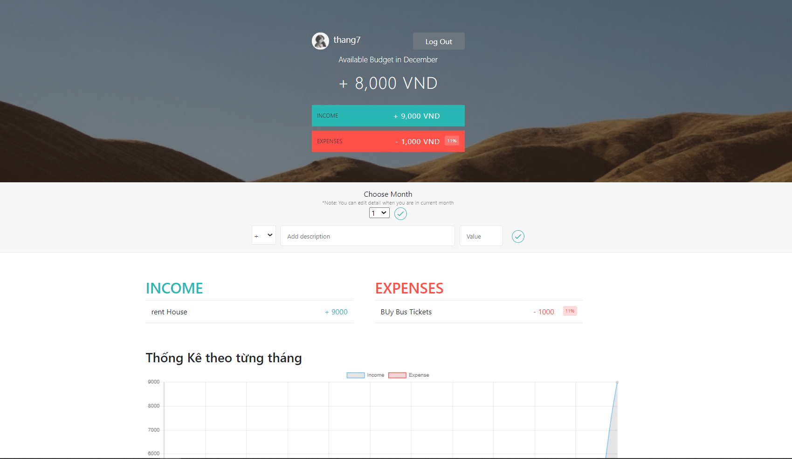

# Budget App
> This is a application helps you store your activities finance such as **income** and **expenses**
## Installation
```bash
git clone (https://github.com/phikhanhcr/BudgetApp)
```
## Usage 
> After cloning this project, you have to create your .env file
> and install all packages reside into project
> Create your own secret cookie string and set up your database (MongoDB)
```python
npm install
npm start
```
## Contributing
Pull requests are welcome. For major changes, please open an issue first to discuss what you would like to change.

Please make sure to update tests as appropriate.

## Some images from this app
